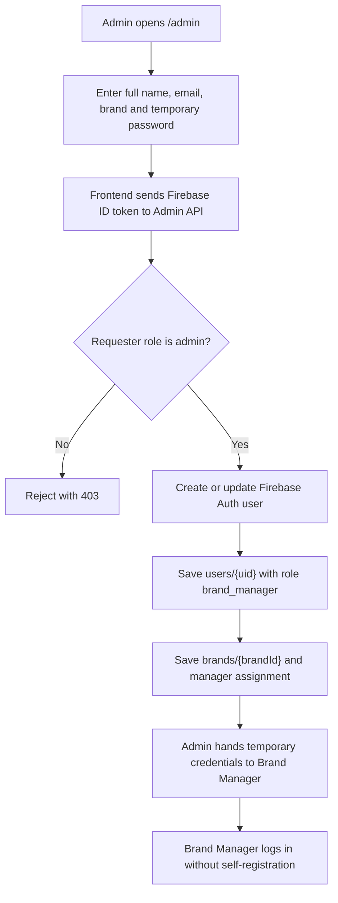

# Sprint 2 - Brand Manager Account Provisioning

## Flow



## Sprint 2 Rules

- Only Admin can create Brand Manager accounts.
- Brand Manager accounts are provisioned; there is no self-registration step.
- Each account is assigned to exactly one brand through `brandId` and `brandName`.
- The account is stored in Firebase Auth and mirrored in Firestore `users/{uid}`.
- Brand assignment is stored in Firestore `brands/{brandId}`.

## Stored User Shape

```json
{
  "uid": "firebase-auth-uid",
  "email": "manager@brand.com",
  "displayName": "Brand Manager Name",
  "role": "brand_manager",
  "brandId": "brand-slug",
  "brandName": "Brand Name",
  "companyDomain": "brand.com",
  "permissions": ["dashboard", "mentions", "alerts", "leads", "reports", "brand_settings"],
  "defaultRoute": "/dashboard",
  "temporaryPasswordIssued": true
}
```

