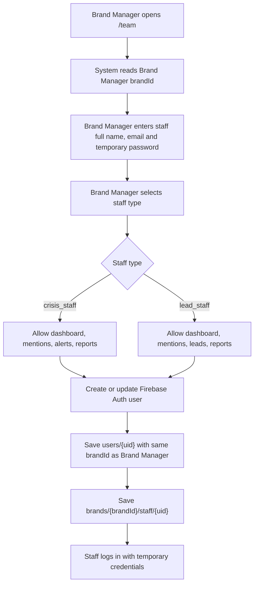

# Sprint 2 - Brand Staff Account Provisioning

## Flow



## Rules

- Only `brand_manager` can create staff accounts in this flow.
- Staff accounts inherit `brandId` and `brandName` from the currently logged-in Brand Manager.
- Staff cannot choose or change brand assignment.
- `crisis_staff` cannot access `/leads`.
- `lead_staff` cannot access `/alerts`.
- Route access also checks the stored `permissions` array for assigned business operations.

## Staff User Shape

```json
{
  "uid": "firebase-auth-uid",
  "email": "staff@brand.com",
  "displayName": "Staff Name",
  "role": "crisis_staff",
  "brandId": "brand-slug",
  "brandName": "Brand Name",
  "permissions": ["dashboard", "mentions", "alerts", "reports"],
  "defaultRoute": "/alerts",
  "temporaryPasswordIssued": true
}
```

