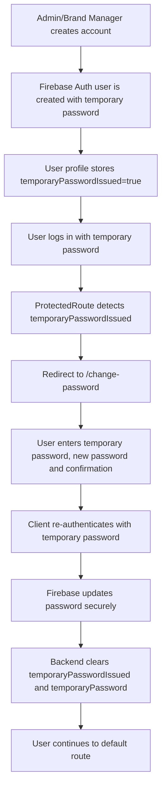

# Sprint 2 - First Login Password Change Flow

## Flow

## Rules

- Brand Manager and staff accounts created with a temporary password must change it before accessing product features.
- New passwords must have at least 10 characters, uppercase, lowercase, number and special character.
- The official password is stored only by Firebase Auth and cannot be viewed by Admin or Brand Manager.
- Staff temporary passwords are visible to the Brand Manager only while `temporaryPasswordIssued=true`.
- To reveal a staff temporary password, the Brand Manager must re-authenticate with their own password.
